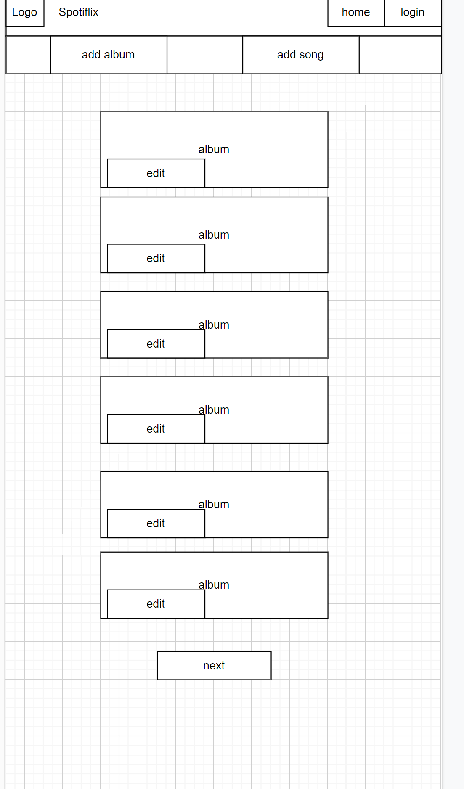
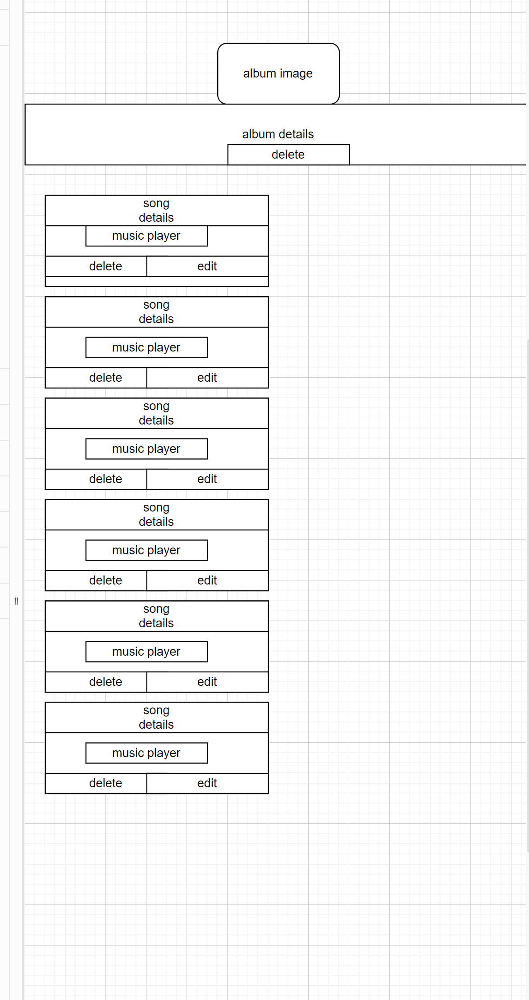
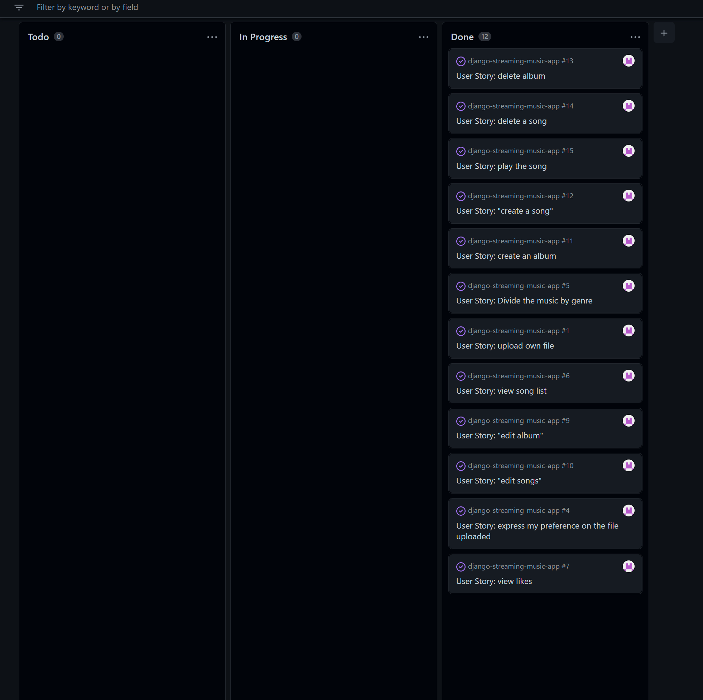
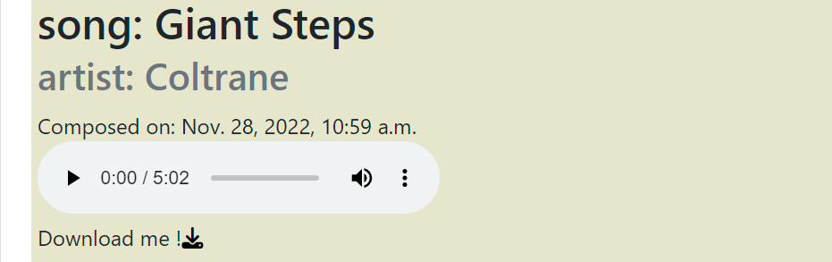
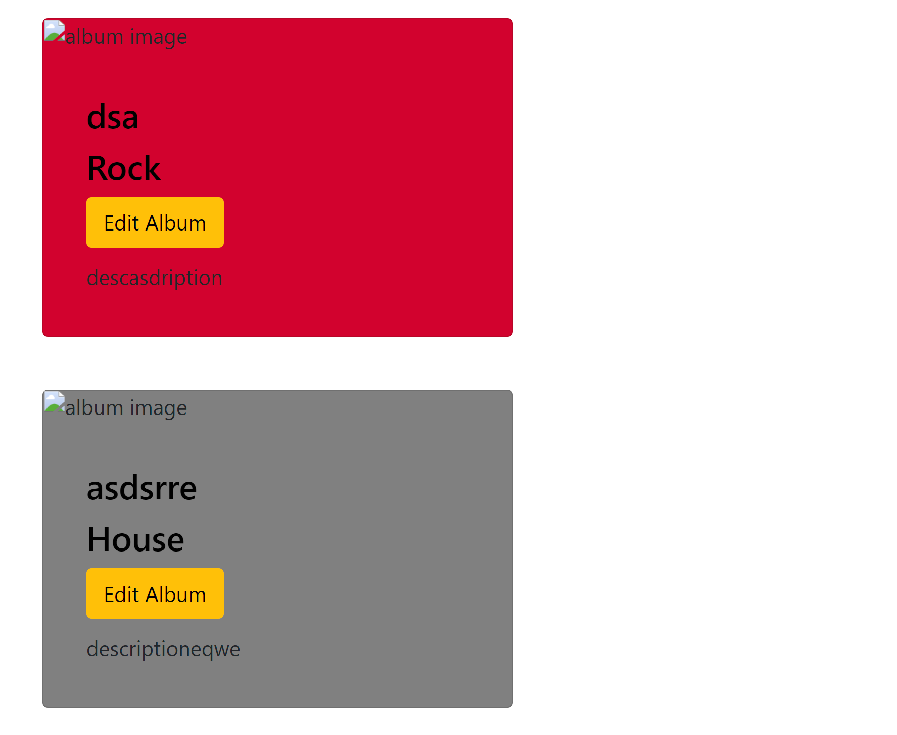
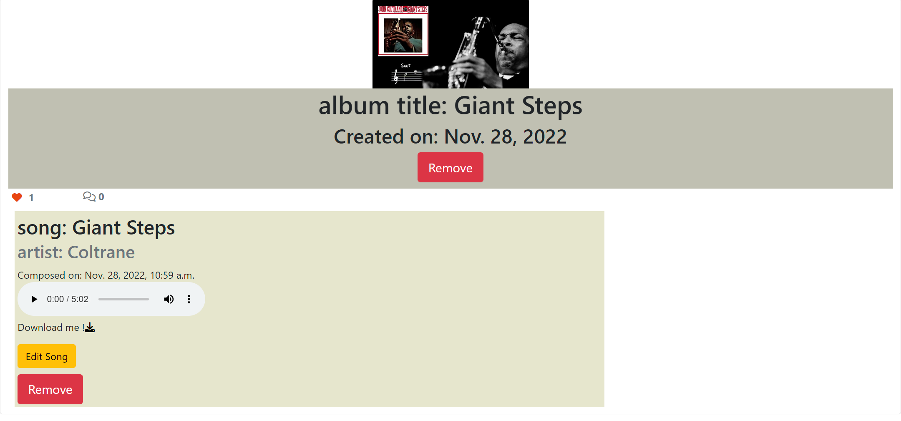

# Spotiflix

Spotiflix is a web page that allows the user to upload songs and create albums to share feedback with other users.

# Wireframe

# Tecnology used:

1. Django Framework
2. AllAuth
3. Elephant Postgres
4. Bootstrap
5. JS
6. CSS
7. HTML
8. Phyton

## Agile methodologies

I used an agile methodology to develop this application opening the issues at the start of the project and step by step moving it to In progress and the end to Done when the feature was complete.

## User Experience (UX)

-   ### User stories
My users' stories are built based on the features that the site needs.
* The first one developed is the feature to create an album with a cover image, the genre with a choice between the most popular, and a description to attract the other user to open the album and listen to the song contained.
* The second is to create a song so the user can upload files in format mp3 with the title and the full name of the artist.

* The Third shows the list of the songs, the user can in practice click on the chosen album and see the song inside it.
* The fourth is to play the song, so the user with this feature can play the music inside the album and in a second moment if liked can download it, the fifth user story developed

* The sixth is to divide the music for the genre, the albums, from the home page, are divided visually for the genre.
the user can recognize all different genres from the color of the album.

* The seventh and eighth is the possibility for the users to edit albums and songs, having the opportunity to make small changes as for misspellings or typos in the excitement to share their favorite songs and albums.

* The ninth feature is focused on the opportunity for the users to leave a like on their favorite albums and show appreciation to the creator of it.

* The tenth is, at this point, for all the users to see the number of likes left on a single album, highlighting the best album to discover
* The last two features are the opportunity for the users to delete albums and songs if not necessary anymore.

  

# Features
## Existing features
* On the opening page the user can find different cards for every album created until now
* The albums are different in color depending on the genre so the user can see at first sight the possible albums to listen to according to their favorite type of music
* On the nav bar and the footer the user can find the link to register an account, log in, and when is logged also the logout
* If the user is logged in 2 buttons appear that give the chance to the user to add one album, one song, or add a song inside an existing album 
* When the user enters one album, can see the songs contained, listen to them, and download it
* From the opening page the user, if authenticated, can add a like to the album, otherwise can only see the number of likes from the community
* if authenticated the user can also edit and remove the albums and songs using the handy button on every card.

## Future features

* Make a difference between normal users and the creator of the album to give the possibility only to those who create the album to make changes, remove or add songs to it
* Have a like button also on the songs
* Create personalized albums for every user based on their favorite genre

# Testing

* Tested views, models, and forms as shown in the Hello Django lessons.
* Tested in views the functionality of add, remove and edit, the actual redirection on the page request, and the response all the time of 200.
* Tested in models the actual creation of a string from the song model contained the song title
* Tested in forms the requirements of all the fields to have the form validated
* The only thing I didn't know how to test is the like functionality, the reason why the overall is not 100% and in the view file I have a percentage of 68%

    ## Automatic testing

## Manual Tests

* Register a new account
    Expected: As a user, I want to register an account to join the community, add albums and songs 
    Test: I tried to register my account with a complete datas request and then with a successful response I tried then to test all the fields one by one leaving it empty to see if the request was passed or if I get an error message to guide me on the step missing    
    Output: When the registration fields are all complete in the right way the account is created, if any fields are missing is raise an alert message is to guide the user on how to proceed and the steps done wrong

* Access specific functionality only if a logged user
    Expected: If the user is not logged in can only access the albums to listen for the songs and have an idea of the community, only if the user want to create, edit, delete, leave a comment or a like need to be logged in   
    Test: From a user not logged in the home page is shown only the albums and their content if clicked, if the user is logged the albums are shown with the edit button present if is owned 
    Output: As said the output change based on the status of the user if logged or not

* Add an album
Expected: When the user fills all the fields the album is created, if something is missing or there is a wrong insertion in any field a message is raised, only the image field is not required because is set as a default image if the field is empty
Test: I tried to add an album filling all the fields and everything works fine with a success message as proof, if I post an empty form in the title field a message is raised that asks to compile it, same for the first name artist, last name artist and album, the only field that passes empty is the song field, but a flash message is raised on the home page saying 'Song not added, the file needs to be an mp3 file
Output: This feature works as expected, as said before

* Add a song
Expected: When the user fills all the fields the song is created, if something is missing or there is a wrong insertion in any field a message is raised.
Test: I tried to add a song filling all the fields and everything works fine with a success message as proof, if I post an empty form in the title field a message is raised that asks to compile it
Output: This feature works as expected, as said before if the user tries to add a song to an album that he does not own a message is raised with a message informing the user that is not possible because not the owner.

* Delete a song or album
Expected: As a user, I want to have the opportunity to delete a song or album  
Test: After I create a song or album I click the red button delete, I can anyway delete only the objects that I create from the moment this button is present only on the songs and albums that I own
Output: The functionality works fine and the object is removed with a message that confirms the deletion

* Edit a song or album
Expected: As a user, I want to have the opportunity to edit the objects that I own if I have made mistakes when I have at first upload my album or song
Test: With the dedicated yellow button I tried to edit a song and an album, I can modify the fields 
Output: The album or song edited to change the output shown

* Opportunity for the superuser/admin to apply all the changes
Expected: The superuser can add, delete and update all the objects
Test: Logging in as superuser I tried to execute all the functionality, ones more in the home page are presents in all the albums the button edit, ones entered in an album the user can delete the songs and albums
Output: As said, to the superuser are shown all the buttons and is allowed to procede with all the functionality 

# Bugs

## Solved bugs
* Found a bug that allows the user to add an image instead of an mp3 file in the Song Form, solved by creating a validation that checks the file content of the file uploaded restricting the allowed only audio/MPEG content, showing to the user a message in the home page, if successfully ('Song added successfully'), if unsuccessfully ('Song was not added, the file needs to be mp3, please try again)

* Found a bug that raises an error when the album title is more than 1 word, fixed using as distinctive parameter the id instead of the title 

* By mistake on the first creation of my AWS bucket I left the secret key and access key public, solved changing the parameters, and hide it in env.py as per Secret key and Database

## Remaining bugs
* At the moment, no new bug discovered

# Deployment

 * Steps for deployment:
    1. Push the code on GitHub
    2. Create a New Heroku app with the current region
    3. Connect your GitHub account to your Heroku account
    4. Select the repository
    5. Set up the settings, as the secret key and the Database URL
    6. The database URL can be defined using Elephantsql

    * Steps for Elephantsql database creation:
       1. Create an account on - https://www.elephantsql.com/
       2. Create the database following the steps
       3. First give a name to your database
       4. Select the region
       5. Apply for the Tiny Turtle plan (Free)

    7. Set up the database value manually in the settings of Heroku copying the URL of the database just to create
    8. After inserting the installed app of the  dependencies installed in the creation of the project and all the values needed to have your app running (check the documentation of every dependency installed for further info)
    9. Be sure to update the code on GitHub and the database with the command 'python3 manage.py makemigrations, and after the command 'python3 manage.py migrate'
    10. Go back to Heroku and in the deploy tab set your favorite way to deploy, manual or automatic.
    11. Click on Deploy.
    11. The live site page can be found at - https://spotiflix-app.herokuapp.com/.

## Content 

* Checked on - https://codepen.io/giana/pen/BZaGyP for some advice about the shadowing.
* Found an exhaustive explanation of how to build up some core functionality by reading the documentation of Django, and Boto3 for uploading the mp3 file and image on AWS S3 bucket ( great thanks also to the tutor support for helping me out when I add struggle to show my style.css file).
* in-depth study about some doubts during the development of the project with the help of https://www.w3schools.com/

## Media 

* Example songs to show the Play and download functionality downloaded from - https://www.soundhelix.com/audio-examples

## Last Thoughts

This project has challenged me in many factors, first of all, the error encountered that I never had the chance to experience, this challenges however they gave me the chance to work on myself and find a solution.
After this project, I feel grown and more conscious of what can wait for me in the next future more ready to sustain different problem solving and able to solve by myself the error that I will encounter. 

# Credits
* Code Institute for the deployment terminal
* My mentor Jack Wachira for his precious advice and the essential preliminary chat for every project I develop since the start of his mentoring.
* The tutors from Code Institute that with patience they helped me in some debugging situations
