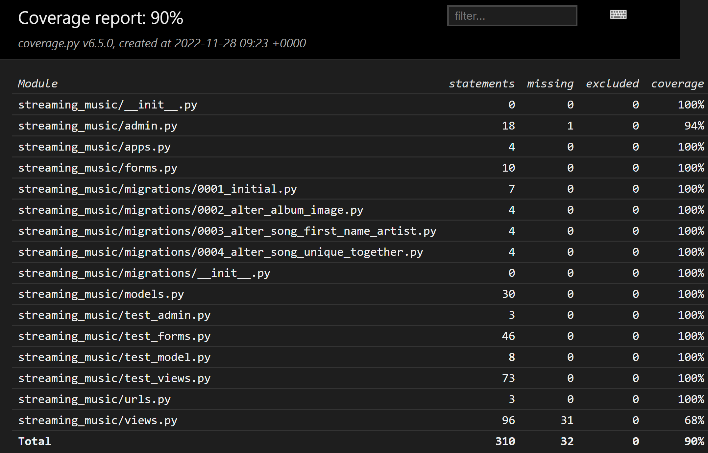

# Spotiflix

Spotiflix is a web page that allows the user to upload songs and create albums to share feedback with other users.

# Wireframe

# Tecnology used:

1. Django Framework
2. AllAuth
3. Elephant Postgres
4. Bootstrap
5. JS
6. CSS
7. HTML
8. Phyton

## User Experience (UX)

-   ### User stories
My users' stories are built based on the features that the site needs.
* The first one developed is the feature to create an album with a cover image, the genre with a choice between the most popular, and a description to attract the other user to open the album and listen to the song contained.
* The second is to create a song so the user can upload files in format mp3 with the title and the full name of the artist.

* The Third shows the list of the songs, the user can in practice click on the chosen album and see the song inside it.
* The fourth is to play the song, so the user with this feature can play the music inside the album and in a second moment if liked can download it, the fifth user story developed
* The sixth is to divide the music for the genre, the albums, from the home page, are divided visually for the genre.
the user can recognize all different genres from the color of the album.

* The seventh and eighth is the possibility for the users to edit albums and songs, having the opportunity to make small changes as for misspellings or typos in the excitement to share their favorite songs and albums.

* The ninth feature is focus on the opportunity for the users to leave a like on their favorite albums and show appreciation to the creator of it.
* The tenth is, at this point, for all the users see the number of likes left on a single album, highlighting the best album to discover
* The last two feature are the opportunity for the users to delete albums and songs if not necessary anymore.
  

# Features
## Existing features
* On the opening page the user can find different cards for every album created until now
* The albums are different in color depending on the genre so the user can see at first sight the possible albums to listen to according to their favorite type of music
* On the nav bar and the footer the user can find the link to register an account, log in, and when is logged also the logout
* If the user is logged in 2 buttons appear that give the chance to the user to add one album, one song, or add a song inside an existing album 
* When the user enters one album, can see the songs contained, listen to them, and download it
* From the opening page the user, if authenticated can add a like to the album, otherwise can only see the number of likes from the community
* if authenticated the user can also edit and remove the albums and songs using the handy button on every card.

## Future features

* Make a difference between normal users and the creator of the album to give the possibility only to those create the album to make changes, remove or add songs to it
* Have a like button also on the songs
* Create personalized albums for every user based on their favorite genre

# Testing

* Tested views, models, and forms as shown in the Hello Django lessons.
* Tested in views the functionality of add, remove and edit, the actual redirection on the page request, and the response all the time of 200.
* Tested in models the actual creation of a string from the song model contained the song title
* Tested in forms the requirements of all the fields to have the form validated
* The only thing I didn't know how to test is the like functionality, the reason why the overall is not 100% and in the view file I have a percentage of 69%
* One error occured when test the edit song functionality, the song is updated only if the file field is filled again, otherwhise an error is raised for MultiDictionary values.

# Bugs

## Solved bugs
* Found a bug that allow the user to add an image instead of a mp3 file in the Song Form, solved creating a validation that check the file content of the file uploaded restricting the allowed only audio/mpeg content, showing to the user a message in the home page, if succesfully ('Song added succesfully'), if unsuccesfully ('Song not added, file needs to be mp3, please try again')

## Remaining bugs
* In the edit process of the song if the file is not reuploaded the form raise an error
* Unfortunately trying to use a technology not yet studied as the AWS bucket, my page stiling in some aspect is difficult to modify, found anyway some help with inline styling using bootstrap.   

# Deployment

 * Steps for deployment:
    1. Push the code done on GitHub
    2. Create a New Heroku app
    3. Connect your GitHub account to your Heroku account
    4. Select the repository 
    5. Click on Deploy.
    6. The live site page can be found on - https://spotiflix-app.herokuapp.com/.

## Content 

* Checked on - https://codepen.io/giana/pen/BZaGyP some advise about the shadowing.
* Found an exhaustive explaination of how to build up some core functionality reading the documentation of Django, Boto3 for upload the mp3 file and image on AWS S3 bucket ( great thanks also to the tutor support for help me out when I add struggle to show my style.css file).
* in-depth study about some doubts during the development of the project with the help of https://www.w3schools.com/

## Media 

* Example songs to show the Play and download functionality downloaded from - https://www.soundhelix.com/audio-examples

# Credits
* Code Institute for the deployment terminal
* My mentor Jack Wachira for his precious advice and the essential preliminary chat for every project I develop since the start of his mentoring.
* The tutors from Code Institute that with patience they helped me in some debugging situations
